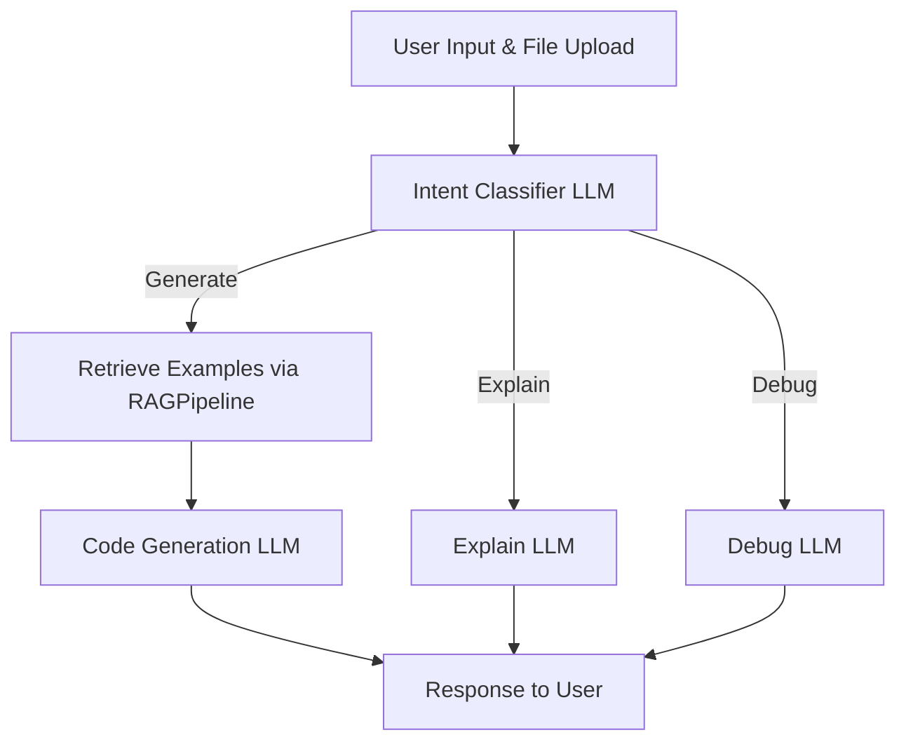

# 🐍 Python Code Assistant with RAG & Intent Routing

&nbsp;&nbsp;&nbsp;&nbsp;&nbsp;&nbsp;&nbsp;&nbsp;&nbsp;&nbsp;&nbsp;&nbsp;&nbsp;&nbsp;&nbsp;&nbsp;&nbsp;&nbsp;&nbsp;&nbsp;&nbsp;&nbsp;&nbsp;&nbsp;&nbsp;&nbsp;&nbsp;&nbsp;&nbsp;&nbsp;&nbsp;&nbsp;&nbsp;&nbsp;&nbsp;&nbsp;&nbsp;&nbsp;&nbsp;&nbsp;&nbsp;&nbsp;&nbsp;&nbsp;&nbsp;&nbsp;&nbsp;&nbsp;&nbsp;&nbsp;&nbsp;&nbsp;&nbsp;&nbsp;
[](https://www.langchain.com/) &nbsp;&nbsp;
[](https://www.python.org/)&nbsp;&nbsp;
[](https://github.com/langchain-ai/langgraph)&nbsp;&nbsp;
[](https://openai.com/)&nbsp;&nbsp;
[](https://www.gradio.app/)


An advanced **Python code assistant** built with **Gradio**, **LangGraph**, and **LangChain**, capable of:
- Understanding your natural language request
- Classifying it into **Generate**, **Explain**, or **Debug**
- Using attached files as context
- Retrieving relevant coding examples from benchmark datasets (**HumanEval**, **MBPP**) via a **Retrieval-Augmented Generation (RAG)** pipeline
- Routing the request to the most suitable LLM model via **OpenRouter**

<br>

## 🚀 Features

- **Multi-intent support**:
  - **Generate** — Add new functions, refactor, or produce code
  - **Explain** — Provide a detailed explanation of code or concepts
  - **Debug** — Identify issues and propose fixes
- **File-aware**: Upload Python files for contextual responses
- **RAG integration**: Retrieve similar problems and solutions to improve generation
- **Flexible LLM routing**: Different models for different intents
- **Interactive UI**: Built with **Gradio**
- **Evaluation tools**: Measure retrieval quality using benchmark datasets

<br>

## 🏗️ Architecture



---

## 📂 Project Structure

```
.
├── gradio_interface.py   # Gradio UI and event handling
├── routing.py            # Intent classification & LLM routing logic
├── rag_pipeline.py       # RAG example retrieval & evaluation
├── requirements.txt      # Python dependencies
├── main.env              # Environment variables (API keys, etc.)
└── README.md             # Project documentation
```

---

## ⚙️ Installation

1. **Clone the repository**:
```bash
git clone https://github.com/ZeyadMohamad/Smart-Python-Code-Assistant.git
cd Smart-Python-Code-Assistant
```

2. **Install dependencies**:
```bash
pip install -r requirements.txt
```

3. **Set up environment variables**:
Create a file called `main.env`:
```env
OPENROUTER_API_KEY=your_openrouter_api_key_here
```
*(You can get your key at [OpenRouter](https://openrouter.ai))*.

---

## 🖥️ Usage

1. **Run the Gradio app**:
```bash
python gradio_interface.py
```

2. **Interact with the assistant**:
   - **Step 1**: Upload any Python file (optional)
   - **Step 2**: Type your request (e.g., "Explain this function", "Debug this code", "Add a function to calculate averages")
   - **Step 3**: The system will classify your intent and route it to the right LLM

---

## 🧠 Example Scenarios

- **Generate**:
  > "Add a function to read a CSV file and return a dictionary."

- **Explain** (with file uploaded):
  > "Explain what this function does and how to optimize it."

- **Debug** (with file uploaded):
  > "This script throws a TypeError when running — fix it."

---

## 📊 Retrieval-Augmented Generation (RAG)

The assistant uses:
- **HumanEval dataset** — For function-writing problems
- **MBPP dataset** — For beginner/intermediate programming problems

Retrieved examples are used to give the LLM additional context when generating code.

---

## 🛠️ Troubleshooting

### **429: Rate limit exceeded**
- You’ve hit the daily limit for `:free` models on OpenRouter.  
  **Fix**: Wait until reset, add credits, or switch to a non-free model.

### **404: No endpoints found**
- The requested model may not be available under your current privacy settings.  
  **Fix**: Enable prompt training in OpenRouter settings or choose a different model.

---

## 📜 License

This project is licensed under the MIT License. See [LICENSE](LICENSE) for details.
